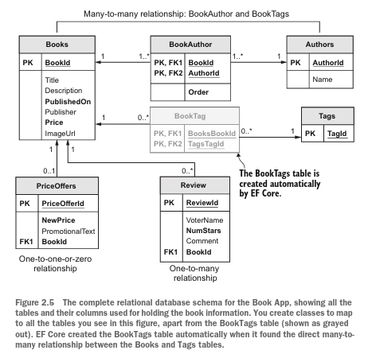

# Chapter 2

In this chapter, you’ll start building the example book-selling site, referred to as the
 *Book App* from now on. This example application provides a good vehicle for looking
 at relationships in queries. This section introduces the database, the various classes,
 and EF Core parts that the Book App needs to access the database.

## Relationships in EF Core

The three main types of relationship in EF Core and Relational Databases are:

- *One-to-one relationship* - PriceOffer to a Book
- *One-to-many relationship* - Book with Reviews
- *Many-to-many relationship* - Books linked to Authors and Books linked to Tags

### One-to-one: PriceOffer to a Book

A book can have a promo price applied to it with an optional row in the PriceOffers table, this is an example of a one-to-one relationship.

```d2
Books: {
    shape: sql_table
    BookId: int { constraint: primary_key}
    Title: string
    Description: string
    etc
}

PriceOffers: {
    shape: sql_table
    PriceOfferId: int { constraint: primary_key}
    NewPrice: money
    PromotionalText: string
    BookId: int { constraint: foreign_key}
    etc
}

Books.BookId -> PriceOffers.BookId: One-to-zero-or-one relationship
```

> The one-to-one relationship betweene a Book and an optional PriceOffer. If a PriceOffer is linked to a Book, the NewPRice in the PriceOffer overrides the Price in the Book.

### One-to-many: Reviews to a Book

You want to allow customers to review a book; they can give a star rating and optionally leave a comment. Because a book may have no reviews, or many (unlimited) reviews, you need to create a table of Reviews which will have a many-to-one relationship with the Books table.

```d2
Books: {
    shape: sql_table
    BookId: int { constraint: primary_key}
    Title: string
    Description: string
}
Review: {
    shape: sql_table
    ReviewId: int { constraint: primary_key}
    BookId: int { constraint: foreign_key}
    Comment: string
    VoterName: string
    NumStars: int
}

Books.BookId <- Review.BookId: One-to-zero-or-many relationship
```

### Many-to-many relationship: Manually configured

Books can be written by one or more authors, and an author may write one or more books. Therefore, you need a table called Books to hold the books data and another table called Authors to hold the authors. The link between the Books and Authors tables is called a many-to-many relationship, which in this case needs a linking table to achieve this relationship. In this case, you create your own linking table with an Order value in it because the names of the authors in a book must be displayed in a specific order.

```d2
Books: {
    shape: sql_table
    BookId: int { constraint: primary_key}
    Title: string
    Description: string
}

BookAuthors: {
    shape: sql_table
    BookId: int { constraint: foreign_key}
    AuthorId: int { constraint: foreign_key}
}

Authors: {
    shape: sql_table
    AuthorId: int { constraint: primary_key}
    Name: string
}

BookAuthors.BookId --> Books.BookId
BookAuthors.AuthorId -> Authors.AuthorId
Books -- Authors: Many-to-many relationship
```

### Other relationship types

- *Owned Type class* — Useful for adding grouped data, such as anAddressclass, to an entity class. TheAddressclass is linked to the mainentity, but your code can copy around theAddressclass rather than copying individualStreet,City, State, and related properties.
- *Table splitting* — Maps multiple classes to one table. You could have a summary class with the basic properties in it and a detailed class containing all the data, for example, which would give you aquicker load of the summary data.
- *Table per hierarchy (TPH)* — Useful for groups of data that are similar. If you have a lot of data with only a few differences,such as a list of animals, you can have a baseAnimalclass thatDog,Cat, andSnakeclasses can inherit, with per-type properties such asLengthOfTailforDogandCatand aVenomousflag for the Snake. EF Core maps all the classes to one table, which can be more efficient.
- *Table per type (TPT)* — Useful for groups of data that have dissimilar data. TPT, introduced in EF Core 5, is the oppositeof TPH, in which each class has its own table. Following theAnimalexample for TPH, the TPT version would map the `Dog` ,`Cat`, and `Snake` classes to three different tables in the database.

These four relationship patterns are built into EF Core to allow you to optimize the
 way you handle or store data in the database. But another relationship type doesn’t
 need specific EF Core commands to implement: hierarchical data. A typical example of
 hierarchical data is an Employee class that has a relationship pointing to the employee’s
 manager, who in turn is an employee. EF Core uses the same approaches as one-to-one
 and one-to-many to provide hierarchical relationships; I talk more about this type of
 relationship in chapters 6 and 8.


